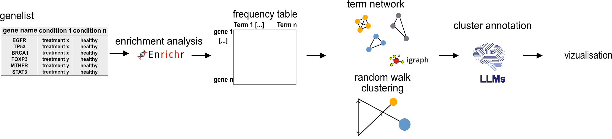

# SummArIzeR 
## SummArIzeR 

<!-- badges: start -->
<!-- badges: end -->

`SummArIzeR` is an R package, that allows an easy use of EnrichR to
compare enrichment results from multiple databases of multiple
conditons. It results in a clustering of enriched terms and enables the
annotation of these terms by creating a promt for large language models
such as gpt4. Results can be vizualised in a Heatmap.

## Features

- Perform enrichment analysis using `enrichR`.
- Allows analysis of multiple conditions
- Analyze up- and down-regulated genes separately.
- Filter terms by p-value and gene thresholds.
- Calculates similarities of results terms based on included genes
- Clusters terms using random walk algorithm
- Generates a prompt for a LLM to summarized cluster annotations
- Allows easy visualization

## Workflow

**Steps to perform an enrichment analysis with `SummArIzeR`:**

- Enrichment analysis
- Treshold selection for Term clustering 
- Term annotation using LLMs 
- Vizualisation

## Citation

If you are using `SummArIzeR` for your publication, please cite us:

SummArIzeR: Simplifying cross-database enrichment result clustering and
annotation via large language models Marie Brinkmann, Michael Bonelli,
Anela Tosevska bioRxiv 2025.05.28.656331; doi:
<https://doi.org/10.1101/2025.05.28.656331>

## Bug Reports

If you encounter any errors or issues, or if you have a suggestion
please file an issue
[here](https://github.com/bonellilab/SummArIzeR/issues).
