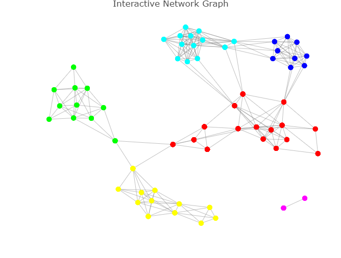
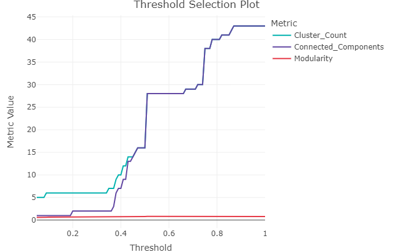
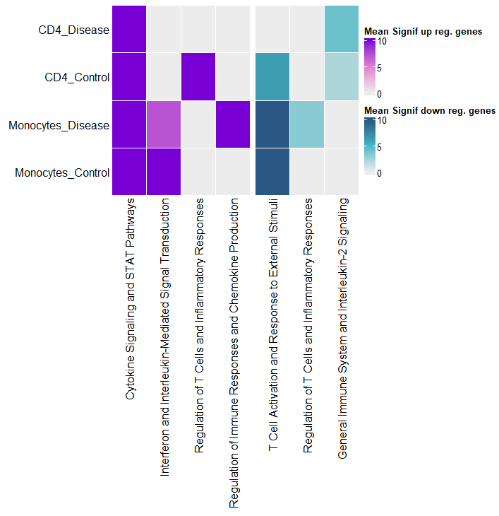

# SummArIzeR

<!-- badges: start -->
<!-- badges: end -->

`SummArIzeR` is an R package, that allows an easy use of EnrichR to compare enrichment results from multiple databases of multiple conditons. It results in a clustering of enriched terms and enables the annotation of these terms by creating a promt for large language models such as gpt4. Results can be vizualised in a Heatmap.


## Features

- Perform enrichment analysis using `enrichR`.
- Allows analysis of multiple conditions and seperate analysis of up-and downregulated genes.
- Filter terms by p-value and gene thresholds.
- Calculate similarities of results terms based on included genes.
- Cluster terms using random walk algorithm.
- Generates a prompt for a LLM to summarized cluster annotations
- Allows easy heatmap visualization

## Installation

You can install the development version of SummArIzeR from [GitHub](https://github.com/) with:

``` {r}
# Install devtools if not already installed
install.packages("devtools")

# Install SummArIzeR
devtools::install_github("bonellilab/SummArIzeR")
```
Additional packages to load: 

``` {r}
# Install factoextra from CRAN
install.packages("factoextra")

# Install `enrichR`
devtools::install_github("wjawaid/enrichR")```
```

## Example

This is a basic example which shows you how to run SummArIzeR.
We create an example dataframe from two celltypes comparing a disease and control group:

``` ruby
library(SummArIzeR)
library(enrichR)
library(factoextra)

genelist_df <- data.frame(
  genes = c(
    "IL6", "IFNG", "IL10", "TNF", "CXCL8", "STAT3", "STAT1", "JAK1", "JAK2", "SOCS1", 
    "SOCS3", "IL1B", "IL18", "IL12A", "IL23A", "GATA3", "RORC", "CCR7", "CXCR3", "CCL2",
    "CCL5", "IRF4", "IRF5", "IL4R", "IL2", "FOXP3", "TGFB1", "IL7R", "IL15", "NFKB1", 
    "IL21", "CXCR5", "TYK2", "IL22", "IL17A", "IL17F", "MCP1", "IL1RN", "CXCL10", "CXCL11", 
    "CD40LG", "IL6R", "IL27", "CD28", "CD80", "CD86", "IL2RA", "CTLA4", "PDCD1"
  ),
  Group = c(
    "Disease", "Disease", "Control", "Disease", "Disease", "Disease", "Control", "Control", "Disease", "Control", 
    "Disease", "Disease", "Control", "Disease", "Disease", "Control", "Disease", "Control", "Disease", "Disease", 
    "Control", "Disease", "Disease", "Control", "Disease", "Control", "Control", "Control", "Disease", "Disease", 
    "Disease", "Control", "Control", "Disease", "Disease", "Disease", "Disease", "Control", "Disease", "Disease", 
    "Disease", "Disease", "Control", "Control", "Control", "Disease", "Control", "Control", "Control"
  ),
  CellType = c(
    "CD4", "CD4", "CD4", "Monocytes", "Monocytes", "CD4", "CD4", "Monocytes", "CD4", "Monocytes", 
    "CD4", "Monocytes", "Monocytes", "CD4", "CD4", "CD4", "CD4", "CD4", "CD4", "Monocytes", 
    "Monocytes", "CD4", "Monocytes", "CD4", "CD4", "CD4", "Monocytes", "CD4", "Monocytes", "Monocytes", 
    "CD4", "CD4", "Monocytes", "CD4", "CD4", "CD4", "Monocytes", "Monocytes", "CD4", "CD4", 
    "CD4", "Monocytes", "CD4", "CD4", "Monocytes", "Monocytes", "CD4", "CD4", "CD4"
  ),
  log2fold = runif(49, -2, 2) # Generate random log2 fold changes between -2 and 2

)
```
We can perform the enrichment analysis for the different conditions CellType and Group:
Here we extract the top 5 hits from every database and every condition.

```ruby
Termlist_all<-extractMultipleTerms(genelist_df, condition_col = c("CellType", "Group"), categories = c("GO_Biological_Process_2023","Reactome_2022", "BioPlanet_2019"), pval_threshold = 0.05, n = 5, split_by_reg = T)

```
```ruby
head(Termlist_all, n = 5)
```

| Term                                                                 | Genes | adj_pval  | dbs                        | condition   | regulation   |
|----------------------------------------------------------------------|-------|-----------|----------------------------|-------------|--------------|
| Regulation Of Tyrosine Phosphorylation Of STAT Protein (GO:0042509)  | IL21  | 4.42e-12  | GO_Biological_Process_2023 | CD4_Disease | up-regulated |
| Regulation Of Tyrosine Phosphorylation Of STAT Protein (GO:0042509)  | SOCS3 | 4.42e-12  | GO_Biological_Process_2023 | CD4_Disease | up-regulated |
| Regulation Of Tyrosine Phosphorylation Of STAT Protein (GO:0042509)  | IL6   | 4.42e-12  | GO_Biological_Process_2023 | CD4_Disease | up-regulated |
| Regulation Of Tyrosine Phosphorylation Of STAT Protein (GO:0042509)  | IFNG  | 4.42e-12  | GO_Biological_Process_2023 | CD4_Disease | up-regulated |
| Regulation Of Tyrosine Phosphorylation Of STAT Protein (GO:0042509)  | IL23A | 4.42e-12  | GO_Biological_Process_2023 | CD4_Disease | up-regulated |


Now term cluster can be assigned based on included genes: 

```ruby
plot<-TRUplotIgraph(Termlist_all, ts  = 0.3)

```


Edges below the similarity treshold (ts) are deleted. 
The optimal treshold can be validated by checking the number of clusters, the connected terms and the modularity:
```{r, cluster network, echo = FALSE}
evaluateThreshold(Termlist_all)
```


After treshold adjustment, clusters can be assigned to the dataframe and the Prompt can be generated:

```ruby
Genelist_test_cluster<-returnIgraphCluster(Termlist_all, ts = 0.3)
generateGPTPrompt(Genelist_test_cluster)
```
The prompt can be queried using a LLM like ChatGPT. The result can be copied into R. 
Now, a final data frame containing the cluster annotations can be created: 

```ruby
#Enter vector from LLM 
cluster_summary <- c(
  '1' = 'Cytokine Signaling and STAT Pathways',
  '2' = 'T Cell Activation and Response to External Stimuli',
  '3' = 'Regulation of T Cells and Inflammatory Responses',
  '4' = 'Interferon and Interleukin-Mediated Signal Transduction',
  '5' = 'Regulation of Immune Responses and Chemokine Production',
  '6' = 'General Immune System and Interleukin-2 Signaling'
)


print(cluster_summary)

Annotation_list<- annotateClusters(Genelist_test_cluster, cluster_summary)
```
The results can be plotted as Heatmap. If the enrichment was done for up-and downregulation seperatly, the Heatmap can be splitted for up-and downregulated genes.

```{r Heatmap,  fig.width=8.27, fig.height=7}

plotHeatmap(Annotation_list, split_by_reg = T, rot = 90, annotation_bar = F, column_names_centered = F)

```

