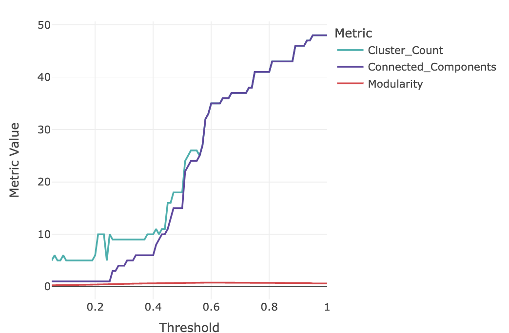

README
================
Anela Tosevska
June 5, 2025

<!-- README.md is generated from README.Rmd. Please edit that file -->

# SummArIzeR

<!-- badges: start -->
<!-- badges: end -->

`SummArIzeR` is an R package, that allows an easy use of EnrichR to
compare enrichment results from multiple databases of multiple
conditons. It results in a clustering of enriched terms and enables the
annotation of these terms by creating a promt for large language models
such as gpt4. Results can be vizualised in a Heatmap.

If you are using `SummArIzeR` for your publication, please cite us:

SummArIzeR: Simplifying cross-database enrichment result clustering and
annotation via large language models Marie Brinkmann, Michael Bonelli,
Anela Tosevska bioRxiv 2025.05.28.656331; doi:
<https://doi.org/10.1101/2025.05.28.656331>

## Features

- Perform enrichment analysis using `enrichR`.
- Allows analysis of multiple conditions
- Analyze up- and down-regulated genes separately.
- Filter terms by p-value and gene thresholds.
- Calculates similarities of results terms based on included genes
- Clusters terms using random walk algorithm
- Generates a prompt for a LLM to summarized cluster annotations
- Allows easy heatmap visualization

## Installation

You can install the development version of SummArIzeR from
[GitHub](https://github.com/) with:

``` r
# Install devtools if not already installed
install.packages("devtools")
#> Installing package into '/home/anela/R/x86_64-pc-linux-gnu-library/4.4'
#> (as 'lib' is unspecified)

# Install SummArIzeR
devtools::install_github("bonellilab/SummArIzeR")
#> Using GitHub PAT from the git credential store.
#> Downloading GitHub repo bonellilab/SummArIzeR@HEAD
#> These packages have more recent versions available.
#> It is recommended to update all of them.
#> Which would you like to update?
#> 
#>  1: All                                   
#>  2: CRAN packages only                    
#>  3: None                                  
#>  4: utf8         (1.2.4  -> 1.2.5 ) [CRAN]
#>  5: pillar       (1.10.1 -> 1.10.2) [CRAN]
#>  6: scales       (1.3.0  -> 1.4.0 ) [CRAN]
#>  7: rlang        (1.1.5  -> 1.1.6 ) [CRAN]
#>  8: cli          (3.6.4  -> 3.6.5 ) [CRAN]
#>  9: openssl      (2.3.2  -> 2.3.3 ) [CRAN]
#> 10: mime         (0.12   -> 0.13  ) [CRAN]
#> 11: jsonlite     (1.8.9  -> 2.0.0 ) [CRAN]
#> 12: curl         (6.2.0  -> 6.2.3 ) [CRAN]
#> 13: stringi      (1.8.4  -> 1.8.7 ) [CRAN]
#> 14: generics     (0.1.3  -> 0.1.4 ) [CRAN]
#> 15: cpp11        (0.5.1  -> 0.5.2 ) [CRAN]
#> 16: ggplot2      (3.5.1  -> 3.5.2 ) [CRAN]
#> 17: Rdpack       (2.6.2  -> 2.6.4 ) [CRAN]
#> 18: MatrixModels (0.5-3  -> 0.5-4 ) [CRAN]
#> 19: doBy         (4.6.25 -> 4.6.27) [CRAN]
#> 20: reformulas   (0.4.0  -> 0.4.1 ) [CRAN]
#> 21: nloptr       (2.1.1  -> 2.2.1 ) [CRAN]
#> 22: lme4         (1.1-36 -> 1.1-37) [CRAN]
#> 23: quantreg     (6.00   -> 6.1   ) [CRAN]
#> 24: pbkrtest     (0.5.3  -> 0.5.4 ) [CRAN]
#> 25: broom        (1.0.7  -> 1.0.8 ) [CRAN]
#> 26: fs           (1.6.5  -> 1.6.6 ) [CRAN]
#> 27: sass         (0.4.9  -> 0.4.10) [CRAN]
#> 28: tinytex      (0.54   -> 0.57  ) [CRAN]
#> 29: xfun         (0.50   -> 0.52  ) [CRAN]
#> 30: later        (1.4.1  -> 1.4.2 ) [CRAN]
#> 31: knitr        (1.49   -> 1.50  ) [CRAN]
#> 32: promises     (1.3.2  -> 1.3.3 ) [CRAN]
#> 33: httpuv       (1.6.15 -> 1.6.16) [CRAN]
#> 34: emmeans      (1.10.7 -> 1.11.1) [CRAN]
#> 35: WriteXLS     (6.7.0  -> 6.8.0 ) [CRAN]
#> 36: data.table   (1.16.4 -> 1.17.4) [CRAN]
#> 
#> ── R CMD build ───────────────────────────────────────────────────────────────────────────────
#>      checking for file ‘/tmp/RtmpVicWYv/remotes3ab7c345c8712a/bonellilab-SummArIzeR-e0fe305/DESCRIPTION’ ...  ✔  checking for file ‘/tmp/RtmpVicWYv/remotes3ab7c345c8712a/bonellilab-SummArIzeR-e0fe305/DESCRIPTION’ (858ms)
#>   ─  preparing ‘SummArIzeR’:
#>    checking DESCRIPTION meta-information ...  ✔  checking DESCRIPTION meta-information
#>   ─  checking for LF line-endings in source and make files and shell scripts
#>   ─  checking for empty or unneeded directories
#>   ─  looking to see if a ‘data/datalist’ file should be added
#>        NB: this package now depends on R (>= 3.5.0)
#>        WARNING: Added dependency on R >= 3.5.0 because serialized objects in
#>      serialize/load version 3 cannot be read in older versions of R.
#>      File(s) containing such objects:
#>        ‘SummArIzeR/data/example_data.rda’
#> ─  building ‘SummArIzeR_0.0.1.tar.gz’
#>      
#> 
#> Installing package into '/home/anela/R/x86_64-pc-linux-gnu-library/4.4'
#> (as 'lib' is unspecified)

# Additional packages

# Install factoextra from CRAN
install.packages("factoextra")
#> Error in install.packages : Updating loaded packages

# Install `enrichR`
devtools::install_github("wjawaid/enrichR")
#> Using GitHub PAT from the git credential store.
#> Skipping install of 'enrichR' from a github remote, the SHA1 (79fad70a) has not changed since last install.
#>   Use `force = TRUE` to force installation
```

## Example

This is a basic example which shows you how to run SummArIzeR. We create
an example dataframe from two celltypes comparing a disease and control
group:

``` r
library(SummArIzeR)
#> Loading required package: circlize
#> ========================================
#> circlize version 0.4.16
#> CRAN page: https://cran.r-project.org/package=circlize
#> Github page: https://github.com/jokergoo/circlize
#> Documentation: https://jokergoo.github.io/circlize_book/book/
#> 
#> If you use it in published research, please cite:
#> Gu, Z. circlize implements and enhances circular visualization
#>   in R. Bioinformatics 2014.
#> 
#> This message can be suppressed by:
#>   suppressPackageStartupMessages(library(circlize))
#> ========================================
#> 
#> Attaching package: 'circlize'
#> The following object is masked from 'package:igraph':
#> 
#>     degree
#> Loading required package: ComplexHeatmap
#> Loading required package: grid
#> ========================================
#> ComplexHeatmap version 2.20.0
#> Bioconductor page: http://bioconductor.org/packages/ComplexHeatmap/
#> Github page: https://github.com/jokergoo/ComplexHeatmap
#> Documentation: http://jokergoo.github.io/ComplexHeatmap-reference
#> 
#> If you use it in published research, please cite either one:
#> - Gu, Z. Complex Heatmap Visualization. iMeta 2022.
#> - Gu, Z. Complex heatmaps reveal patterns and correlations in multidimensional 
#>     genomic data. Bioinformatics 2016.
#> 
#> 
#> The new InteractiveComplexHeatmap package can directly export static 
#> complex heatmaps into an interactive Shiny app with zero effort. Have a try!
#> 
#> This message can be suppressed by:
#>   suppressPackageStartupMessages(library(ComplexHeatmap))
#> ========================================
#> Loading required package: plotly
#> 
#> Attaching package: 'plotly'
#> The following object is masked from 'package:ComplexHeatmap':
#> 
#>     add_heatmap
#> The following object is masked from 'package:ggplot2':
#> 
#>     last_plot
#> The following object is masked from 'package:igraph':
#> 
#>     groups
#> The following object is masked from 'package:stats':
#> 
#>     filter
#> The following object is masked from 'package:graphics':
#> 
#>     layout
#> Loading required package: proxy
#> 
#> Attaching package: 'proxy'
#> The following objects are masked from 'package:stats':
#> 
#>     as.dist, dist
#> The following object is masked from 'package:base':
#> 
#>     as.matrix
#> Loading required package: stringr
#> Loading required package: tidyr
#> 
#> Attaching package: 'tidyr'
#> The following object is masked from 'package:igraph':
#> 
#>     crossing
#> 
#> Attaching package: 'SummArIzeR'
#> The following objects are masked _by_ '.GlobalEnv':
#> 
#>     annotateClusters, plotBubbleplot, plotHeatmap, poolPValues
library(enrichR)
#> Welcome to enrichR
#> Checking connections ...
#> Enrichr ... Connection is Live!
#> FlyEnrichr ... Connection is Live!
#> WormEnrichr ... Connection is Live!
#> YeastEnrichr ... Connection is Live!
#> FishEnrichr ... Connection is Live!
#> OxEnrichr ... Connection is Live!
library(factoextra)
#> Welcome! Want to learn more? See two factoextra-related books at https://goo.gl/ve3WBa

set.seed(1234)

genelist_df <- data.frame(
  genes = c(
    "IL6", "IFNG", "IL10", "TNF", "CXCL8", "STAT3", "STAT1", "JAK1", "JAK2", "SOCS1", 
    "SOCS3", "IL1B", "IL18", "IL12A", "IL23A", "GATA3", "RORC", "CCR7", "CXCR3", "CCL2",
    "CCL5", "IRF4", "IRF5", "IL4R", "IL2", "FOXP3", "TGFB1", "IL7R", "IL15", "NFKB1", 
    "IL21", "CXCR5", "TYK2", "IL22", "IL17A", "IL17F", "MCP1", "IL1RN", "CXCL10", "CXCL11", 
    "CD40LG", "IL6R", "IL27", "CD28", "CD80", "CD86", "IL2RA", "CTLA4", "PDCD1"
  ),
  Group = c(
    "Disease", "Disease", "Control", "Disease", "Disease", "Disease", "Control", "Control", "Disease", "Control", 
    "Disease", "Disease", "Control", "Disease", "Disease", "Control", "Disease", "Control", "Disease", "Disease", 
    "Control", "Disease", "Disease", "Control", "Disease", "Control", "Control", "Control", "Disease", "Disease", 
    "Disease", "Control", "Control", "Disease", "Disease", "Disease", "Disease", "Control", "Disease", "Disease", 
    "Disease", "Disease", "Control", "Control", "Control", "Disease", "Control", "Control", "Control"
  ),
  CellType = c(
    "CD4", "CD4", "CD4", "Monocytes", "Monocytes", "CD4", "CD4", "Monocytes", "CD4", "Monocytes", 
    "CD4", "Monocytes", "Monocytes", "CD4", "CD4", "CD4", "CD4", "CD4", "CD4", "Monocytes", 
    "Monocytes", "CD4", "Monocytes", "CD4", "CD4", "CD4", "Monocytes", "CD4", "Monocytes", "Monocytes", 
    "CD4", "CD4", "Monocytes", "CD4", "CD4", "CD4", "Monocytes", "Monocytes", "CD4", "CD4", 
    "CD4", "Monocytes", "CD4", "CD4", "Monocytes", "Monocytes", "CD4", "CD4", "CD4"
  ),
  log2fold = c(1.65922417, 1.74830165, -0.85544186, 1.32179050, 0.56698208, 0.07638380, 0.94635326, -1.46133361, 0.62796916, 0.82025914, -0.16903290, 0.87644901, 1.73868899, -0.97828470, -0.15082871, 1.76005809, 1.91290571, -1.53005055, -0.10001167, 0.24133098, 1.61612555, -1.44515933, 1.95556692, 1.78667293, -1.67024977, 0.05684714, -0.43918613, 1.62295252, -0.21212149, 1.34401704, 0.95038247, 1.24422057, -0.44756687, 0.74067892, -1.98420664, 1.33166432, -1.97066341, -1.16936411, 1.62640563, 0.44711457, -0.48176304, -0.25691366, -1.85027587, 1.89415966, -0.27299500, 1.83030639, 1.55101962, 0.55991508, 1.88386644)
)
```

We can perform the enrichment analysis for the different conditions
CellType and Group: Here we extract the top 5 hits from every database
and every condition. The input is data.frame with gene-level data. Must
include a “genes” column, conditions column, and, optionally, “log2fold”
if splitting by regulation. If split_by_reg (default = FALSE) is set to
TRUE, enrichment is performed separately on up- and down-regulated
genes. The logFC_threshold (default = 0) parameter defines the log
fold-change cutoff used to define up/down regulation when split_by_reg =
TRUE. The adjusted p-value cutoff is used to filter significant enriched
terms. The parameter n (default = 10) shwos the number of top enriched
terms to return per condition and per category, whereas the
min_genes_threshold (default = 3) is the minimum number of genes
required to consider a term in downstream analysis. The enrichment
categories can be chosen from the set of libraries available in
[EnrichR](https://maayanlab.cloud/Enrichr/#libraries).

    #> # A tibble: 5 × 6
    #>   Term                                    Genes      adj_pval dbs         condition regulation
    #>   <chr>                                   <chr>         <dbl> <chr>       <chr>     <chr>     
    #> 1 Cellular Response To Virus (GO:0098586) IL21   0.0000000346 GO_Biologi… CD4_Dise… up-regula…
    #> 2 Cellular Response To Virus (GO:0098586) CXCL10 0.0000000346 GO_Biologi… CD4_Dise… up-regula…
    #> 3 Cellular Response To Virus (GO:0098586) IL6    0.0000000346 GO_Biologi… CD4_Dise… up-regula…
    #> 4 Cellular Response To Virus (GO:0098586) IFNG   0.0000000346 GO_Biologi… CD4_Dise… up-regula…
    #> 5 Cellular Response To Virus (GO:0098586) JAK2   0.0000000346 GO_Biologi… CD4_Dise… up-regula…

Edges below the similarity treshold (ts) are deleted. The optimal
treshold can be validated by checking the number of clusters, the
connected terms and the modularity. The threshold value determins which
edges between terms (nodes) are retained in the network (those with a
distance weight higher than ts). Smaller values include more edges;
larger values result in sparser graphs.

    #> `google-chrome`, `chromium-browser` and `chrome` were not found. Try setting the `CHROMOTE_CHROME` environment variable to the executable of a Chromium-based browser, such as Google Chrome, Chromium or Brave or adding one of these executables to your PATH.



The network can be interactively visualized, and if needed, the
threshold can be readjusted.

``` r
plot<-TRUplotIgraph(Termlist_all, ts  = 0.3)
```


``` r
#htmltools::tagList(plot)
```

After treshold adjustment, clusters can be assigned to the dataframe and
the Prompt can be generated:

``` r
Genelist_test_cluster<-returnIgraphCluster(Termlist_all, ts = 0.3)
head(Genelist_test_cluster, n = 5)
#> # A tibble: 5 × 8
#> # Groups:   condition, Term, regulation [5]
#>   Term        adj_pval condition regulation Cluster dbs   num_genes_per_term genelist_per_term
#>   <chr>          <dbl> <chr>     <chr>        <dbl> <chr>              <int> <list>           
#> 1 Cellular R…  3.46e-8 CD4_Dise… up-regula…       4 GO_B…                  5 <chr [5]>        
#> 2 Positive R…  6.17e-8 CD4_Dise… up-regula…       4 GO_B…                  5 <chr [5]>        
#> 3 Inflammato…  6.87e-8 CD4_Dise… up-regula…       6 GO_B…                  6 <chr [6]>        
#> 4 Regulation…  6.87e-8 CD4_Dise… up-regula…       4 GO_B…                  6 <chr [6]>        
#> 5 Cytokine-M…  8.30e-8 CD4_Dise… up-regula…       1 GO_B…                  6 <chr [6]>
generateGPTPrompt(Genelist_test_cluster)
#> Cluster 1:
#> Please find a summary term for the following terms: Cytokine-Mediated Signaling Pathway (GO:0019221), Positive Regulation Of Cytokine Production (GO:0001819), Signaling By Interleukins R-HSA-449147, Cytokine Signaling In Immune System R-HSA-1280215, Interleukin-4 And Interleukin-13 Signaling R-HSA-6785807, Immune System R-HSA-168256, Jak-STAT signaling pathway, Interleukin-23-mediated signaling events, Cytokine-cytokine receptor interaction, Immune system signaling by interferons, interleukins, prolactin, and growth hormones, Signaling by interleukins, Interleukin-2 signaling pathway, Immune system, Interleukin-7 signaling pathway
#> 
#> Cluster 2:
#> Please find a summary term for the following terms: T Cell Differentiation (GO:0030217), T Cell Receptor Signaling Pathway (GO:0050852), T Cell Activation (GO:0042110), Costimulation By CD28 Family R-HSA-388841
#> 
#> Cluster 3:
#> Please find a summary term for the following terms: Regulation of NFAT transcription factors, RUNX1 And FOXP3 Control Development Of Regulatory T Lymphocytes (Tregs) R-HSA-8877330, Transcriptional Regulation By RUNX1 R-HSA-8878171
#> 
#> Cluster 4:
#> Please find a summary term for the following terms: Cellular Response To Virus (GO:0098586), Positive Regulation Of Tumor Necrosis Factor Superfamily Cytokine Production (GO:1903557), Regulation Of Inflammatory Response (GO:0050727), Regulation Of Interleukin-17 Production (GO:0032660), Regulation Of Tyrosine Phosphorylation Of STAT Protein (GO:0042509), Positive Regulation Of Lymphocyte Proliferation (GO:0050671), Interleukin-6 Signaling R-HSA-1059683, Interleukin-27-mediated signaling events, Interleukin-22 soluble receptor signaling pathway, Interleukin-12/STAT4 pathway
#> 
#> Cluster 5:
#> Please find a summary term for the following terms: Th1/Th2 differentiation pathway, Inflammatory response pathway
#> 
#> Cluster 6:
#> Please find a summary term for the following terms: Inflammatory Response (GO:0006954), Response To Lipopolysaccharide (GO:0032496), Cellular Response To Lipid (GO:0071396), Cellular Response To Molecule Of Bacterial Origin (GO:0071219), Cellular Response To Lipopolysaccharide (GO:0071222), Cellular Response To Cytokine Stimulus (GO:0071345), Interleukin-10 Signaling R-HSA-6783783, Toll-like receptor signaling pathway regulation, Regulation Of Calcidiol 1-Monooxygenase Activity (GO:0060558), Interleukin-3 regulation of hematopoietic cells, NOD signaling pathway, Chagas disease, Interleukin-1 regulation of extracellular matrix, NF-kappaB activation by non-typeable Hemophilus influenzae
#> 
#> Cluster 7:
#> Please find a summary term for the following terms: Regulation Of Protein Localization To Nucleus (GO:1900180), Positive Regulation Of Protein Localization To Nucleus (GO:1900182), Positive Regulation Of Protein Localization (GO:1903829)
#> 
#> Cluster 8:
#> Please find a summary term for the following terms: Positive Regulation Of Interleukin-10 Production (GO:0032733), Positive Regulation Of Interleukin-12 Production (GO:0032735)
#> 
#> Cluster 9:
#> Please find a summary term for the following terms: Selective expression of chemokine receptors during T-cell polarization
#> 
#> Please summarize the following clusters of terms with a single term for each cluster. 
#>  Then, assign the cluster numbers to these summary terms in an R vector, called `cluster_summary`, formatted as:
#>  '1' = 'Summary Term 1', '2' = 'Summary Term 2', ..., 'n' = 'Summary Term n'.
```

The prompt can be queried using a LLM like ChatGPT. The result can be
copied into R. Now, a final data frame containing the cluster
annotations can be created:

``` r
#Enter vector from LLM 
cluster_summary <- c(
  '1' = 'T Cell Transcriptional Regulation',
  '2' = 'Interleukin Signaling Pathways',
  '3' = 'Inflammatory Response Activation',
  '4' = 'STAT and IL-17 Pathway Regulation',
  '5' = 'Cytokine-Mediated Immune Signaling',
  '6' = 'T Cell Proliferation and Inflammatory Regulation',
  '7' = 'IL-20 Family Signaling',
  '8' = 'Cytokine Response',
  '9' = 'Type II Interferon Response',
  '10' = 'Antiviral Cellular Response',
  '11' = 'Chemokine Signaling',
  '12' = 'Negative Regulation of Organismal Processes',
  '13' = 'Th17 Cell Differentiation',
  '14' = 'Th1/Th2 Cell Differentiation'
)


print(cluster_summary)
#>                                                  1 
#>                "T Cell Transcriptional Regulation" 
#>                                                  2 
#>                   "Interleukin Signaling Pathways" 
#>                                                  3 
#>                 "Inflammatory Response Activation" 
#>                                                  4 
#>                "STAT and IL-17 Pathway Regulation" 
#>                                                  5 
#>               "Cytokine-Mediated Immune Signaling" 
#>                                                  6 
#> "T Cell Proliferation and Inflammatory Regulation" 
#>                                                  7 
#>                           "IL-20 Family Signaling" 
#>                                                  8 
#>                                "Cytokine Response" 
#>                                                  9 
#>                      "Type II Interferon Response" 
#>                                                 10 
#>                      "Antiviral Cellular Response" 
#>                                                 11 
#>                              "Chemokine Signaling" 
#>                                                 12 
#>      "Negative Regulation of Organismal Processes" 
#>                                                 13 
#>                        "Th17 Cell Differentiation" 
#>                                                 14 
#>                     "Th1/Th2 Cell Differentiation"
```

The clusters can now be annotated based on the vectors defined above.
Here, one could specify different methods for pooling p-values resulting
from multiple terms. In addition, this pooled p-value is capped at a
min_pval (default = 1e-10), making it better suitable for plotting.
However, users can select a lower min_pval threshold.

``` r
Annotation_list<- annotateClusters(Genelist_test_cluster, cluster_summary)
#> Warning: There were 11 warnings in `dplyr::mutate()`.
#> The first warning was:
#> ℹ In argument: `pval_pooled = poolPValues(adj_pval, method = method, weights = weights,
#>   min_pval = min_pval)`.
#> ℹ In group 1: `condition = "CD4_Control"` `Cluster = 1`.
#> Caused by warning in `poolPValues()`:
#> ! Pooled p-value capped to minimum threshold: 1.0e-10
#> ℹ Run `dplyr::last_dplyr_warnings()` to see the 10 remaining warnings.
```

The results can be plotted as a Bubbleplot. If the enrichment was done
for up-and downregulation seperatly, the plot will be split for up-and
downregulated genes.

``` r

plotBubbleplot(Annotation_list)
```


Additionally, the results can be plotted as a Heatmap. If the enrichment
was done for up-and downregulation seperatly, the Heatmap can be split
for up-and downregulated genes. The heatmap can be further customized by
setting cluster_rows/columns to TRUE.

``` r

#plotHeatmap(Annotation_list, rot = 90, annotation_bar = F, column_names_centered = F)
```

If you encounter any errors or issues, or if you have a suggestion
please file an issue
[here](https://github.com/bonellilab/SummArIzeR/issues).
